# Run Hadoop program locally with Intellij and Maven

You may use this method to write and test your Hadoop program locally without configuring Hadoop environment on your own machine or using the clusters. This tutorial is based on [Hadoop: Intellij结合Maven本地运行和调试MapReduce程序 (无需搭载Hadoop和HDFS环境)
](https://www.polarxiong.com/archives/Hadoop-Intellij%E7%BB%93%E5%90%88Maven%E6%9C%AC%E5%9C%B0%E8%BF%90%E8%A1%8C%E5%92%8C%E8%B0%83%E8%AF%95MapReduce%E7%A8%8B%E5%BA%8F-%E6%97%A0%E9%9C%80%E6%90%AD%E8%BD%BDHadoop%E5%92%8CHDFS%E7%8E%AF%E5%A2%83.html), [How-to: Create an IntelliJ IDEA Project for Apache Hadoop](https://blog.cloudera.com/blog/2014/06/how-to-create-an-intellij-idea-project-for-apache-hadoop/) and [Developing Hadoop Mapreduce Application within Intellij IDEA on Windows 10](https://bigdataproblog.wordpress.com/2016/05/20/developing-hadoop-mapreduce-application-within-intellij-idea-on-windows-10/).

---

## Prerequisites

- [Oracle JDK 8](https://www.oracle.com/java/technologies/downloads/#java8)
  - JDK 8 can have name JDK 8 and JDK 1.8, do not use JDK 18.
  - Oracle JDK is strongly recommended, OpenJDK may have unexpected errors.
  - Other versions of JDK, like 9, 11, etc, may not work.
- [Apache Maven](https://maven.apache.org/download.cgi)
- [Apache Hadoop](https://hadoop.apache.org/releases.html)
- [IntelliJ IDEA](https://www.jetbrains.com/idea/download)

---

## Software Installation

### Install Oracle JDK 8

Current latest version: `8u333` (`1.8.0_333`).

#### Linux (JDK 8)

1. Download from [https://www.oracle.com/java/technologies/downloads/#java8-linux](https://www.oracle.com/java/technologies/downloads/#java8-linux) (free account required), **x64 Compressed Archive** (filename **jdk-8u333-linux-x64.tar.gz**) is recommended since it does not require installation.
   - Download **x86 Compressed Archive** (filename **jdk-8u333-linux-i586.tar.gz**) if your system is 32-bit.
2. Untar the download archive to anywhere you like, the path should not contain any space. For example, `~/jdk1.8.0_333`.

#### macOS (JDK 8)

1. Download from [https://www.oracle.com/java/technologies/downloads/#java8-mac](https://www.oracle.com/java/technologies/downloads/#java8-mac) (free account required), only **x64 DMG Installer** (filename **jdk-8u333-macosx-x64.dmg**) is provided.
2. Mount the dmg file and install JDK 8 to the default location `/Library/Java/JavaVirtualMachines/jdk1.8.0_333.jdk`.

#### Windows (JDK 8)

1. If your Windows account name (you can find it under `C:\Users`) contains space, create another account without space, otherwise Hadoop will not work properly.
2. Download from [https://www.oracle.com/java/technologies/downloads/#java8-windows](https://www.oracle.com/java/technologies/downloads/#java8-windows) (free account required), **x64 Installer** (filename **jdk-8u333-windows-x64.exe**) is recommended
   - Download **x86 Installer** (filename **jdk-8u333-windows-i586.exe**) if your system is 32-bit.
3. Install it, but ***DO NOT*** install it to the default location (under `C:\Program Files` or `C:\Program Files (x86)`). Instead, install it to a location with no space in the path, such as `C:\jdk1.8.0_333`.
   1. During the installation, change the **Intall to** of **Development Tools** to `C:\jdk1.8.0_333` (remove `Program Files\Java\` from the default path `C:\Program Files\Java\jdk1.8.0_333`).
   2. Click the drive icon of **Source Code** and **Public JRE**, and disable them.
      <p align="center">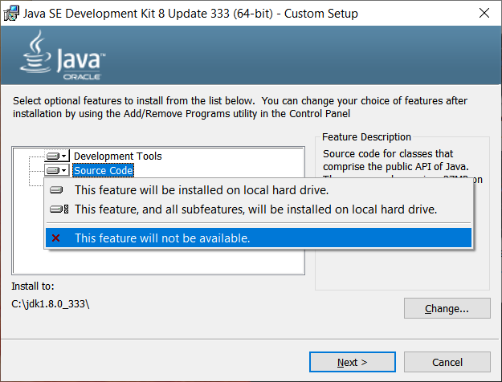</p>
   3. The custom setup page should look this this.
      <p align="center">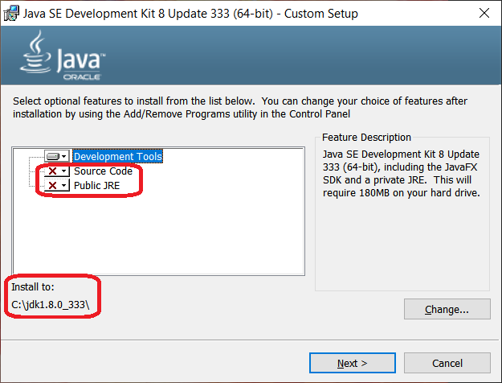</p>

### Install Apache Maven

#### Linux and macOS (Maven)

1. Download **Binary tar.gz archive** (filename **apache-maven-3.8.5-bin.tar.gz**) from [https://maven.apache.org/download.cgi](https://maven.apache.org/download.cgi).
2. Decompress the archive to `~/apache-maven-3.8.5`

#### Windows (Maven)

1. Download **Binary zip archive** (filename **apache-maven-3.8.5-bin.zip**) for Windows from [https://maven.apache.org/download.cgi](https://maven.apache.org/download.cgi).
2. Decompress the archive to `C:\apache-maven-3.8.5`

### Install Apache Hadoop

#### Linux and macOS (Hadoop)

1. Download the binary of the latest version `3.3.3` from [https://hadoop.apache.org/releases.html](https://hadoop.apache.org/releases.html)
2. Untar the downloaded *.tar.gz* file to `~/hadoop-3.3.3`.

#### Windows (Hadoop)

Hadoop on Windows must be patched, otherwise it will not work at all. The latest patch available is for Hadoop 3.2.2, so you should use an older version of Hadoop.

1. Download the binary of version `3.2.2` from [https://archive.apache.org/dist/hadoop/common/hadoop-3.2.2/hadoop-3.2.2.tar.gz](https://archive.apache.org/dist/hadoop/common/hadoop-3.2.2/hadoop-3.2.2.tar.gz).
2. Use [7-Zip](https://www.7-zip.org/) to untar the downloaded *.tar.gz* file.
   1. Use 7-Zip to open the downloaded **hadoop-3.2.2.tar.gz**.
   2. Double click **hadoop-3.2.2.tar**, it takes some time to decompress.
      <p align="center">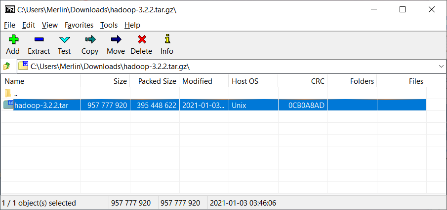</p>
   3. Select the folder **hadoop-3.2.2**, then click **Extract**. Do not directly drag the folder to untar.
      <p align="center">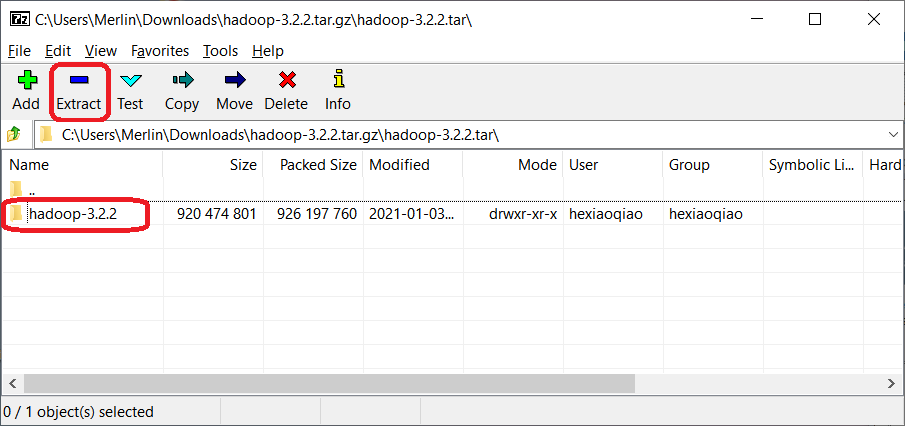</p>
   4. In the dialog, change **Copy to** path to `C:\`, then **OK**.
      <p align="center">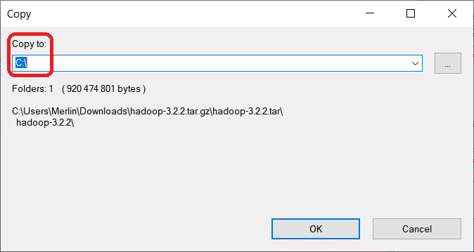</p>
   5. It takes some to untar the files. If you see errors like *Cannot create symbolic link: ...*, just click **Close** to ignore those errors. Windows does not support Unix style symbolic links, and these error files will not be used on Windows. So it is safe to ignore these errors.
3. Download the patch.
   1. Open [https://download-directory.github.io/](https://download-directory.github.io/), paste `https://github.com/cdarlint/winutils/tree/master/hadoop-3.2.2/bin` into the text box and press **Enter**. This will download you a single folder of a Github repository. The downloaded file should be **cdarlint winutils master hadoop-3.2.2-bin.zip**.
   2. Open the downloaded zip file, and extract all the 15 files to `C:\hadoop-3.2.2\bin` and overwrite the existing files (there should be 8 files to overwrite).
   - If [https://download-directory.github.io/](https://download-directory.github.io/) is down, you can find some other tools to download a single Github folder. Or you can clone [https://github.com/cdarlint/winutils](https://github.com/cdarlint/winutils), and copy the files inside `winutils\hadoop-3.2.2\bin\`.

### Install IntelliJ Community Edition

Download and install the latest version from [https://www.jetbrains.com/idea/download/](https://www.jetbrains.com/idea/download/).

If you use Ubuntu, you can install it from the Software Center, make sure you download the community edition. Or you can use the following command

```bash
sudo snap install intellij-idea-community --classic
```

### Alternative Solutions for Windows

Hadoop may still not work properly on Windows. You can either install a Linux in a virtual machine like [VirtualBox](https://www.virtualbox.org/wiki/Downloads), or install [WSL](https://ubuntu.com/wsl), then download all software and configure using the instructions for Linux.

---

## Environment Configuration

### Linux and macOS (Environment)

1. Run the following command

   ```bash
   touch ~/.profile
   ```

2. Add the following lines to `~/.profile`.

   ```bash
   # Use this line below for Linux
   export JAVA_HOME="/home/$LOGNAME/jdk1.8.0_333"
   # Use this line below for macOS
   export JAVA_HOME="/Library/Java/JavaVirtualMachines/jdk1.8.0_333.jdk/Contents/Home"

   # Copy the following lines
   export MAVEN_HOME="/home/$LOGNAME/apache-maven-3.8.5"
   export HADOOP_HOME="/home/$LOGNAME/hadoop-3.3.3"

   export PATH=$HADOOP_HOME/bin:$MAVEN_HOME/bin:$JAVA_HOME/bin:$PATH
   ```

3. Restart the terminal, or run

    ```bash
    source ~/.profile
    ```

4. Test `*_HOME`, run

    ```bash
    echo $JAVA_HOME
    echo $MAVEN_HOME
    echo $HADOOP_HOME
    ```

    They should not print empty lines, but the paths you just configured.

5. Test Java compiler, run

    ```bash
    javac -version
    ```

    It should print

    ```text
    javac 1.8.0_333
    ```

6. Test Maven, run

    ```bash
    mvn -version
    ```

    It should print (path and OS information may differ)

    ```text
    Apache Maven 3.8.5 (3599d3414f046de2324203b78ddcf9b5e4388aa0)
    Maven home: /Users/Merlin/apache-maven-3.8.5
    Java version: 1.8.0_333, vendor: Oracle Corporation, runtime: /Library/Java/JavaVirtualMachines/jdk1.8.0_333.jdk/Contents/Home/jre
    Default locale: en_US, platform encoding: UTF-8
    OS name: "mac os x", version: "12.3", arch: "x86_64", family: "mac"
    ```

7. Test Hadoop, run

    ```bash
    hadoop version
    ```

    It should print

    ```text
    Hadoop 3.3.3
    Source code repository https://github.com/apache/hadoop.git -r d37586cbda38c338d9fe481addda5a05fb516f71
    Compiled by stevel on 2022-05-09T16:36Z
    Compiled with protoc 3.7.1
    From source with checksum eb96dd4a797b6989ae0cdb9db6efc6
    This command was run using /Users/Merlin/hadoop-3.3.3/share/hadoop/common/hadoop-common-3.3.3.jar
    ```

### Windows (Environment)

1. Search for `View advanced system settings` in the task bar (case insensitive) and open it.
    <p align="center">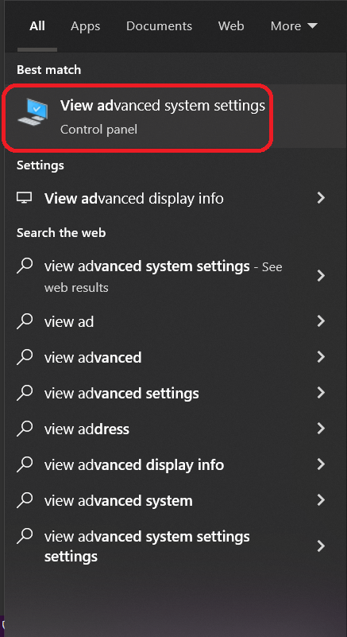</p>
2. Click **Environment Variables...**.
    <p align="center">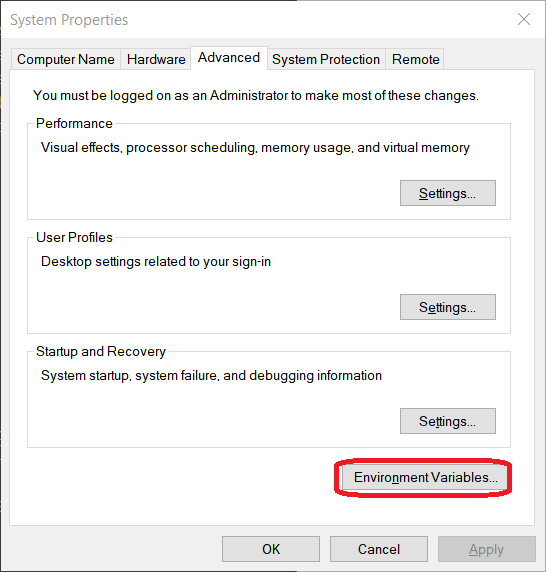</p>
3. Click the first **New** button to create an environment for the **current user** (you can also do this and the following steps for **System variables**, but make you all your changes are all for the current user or for the system).
    <p align="center">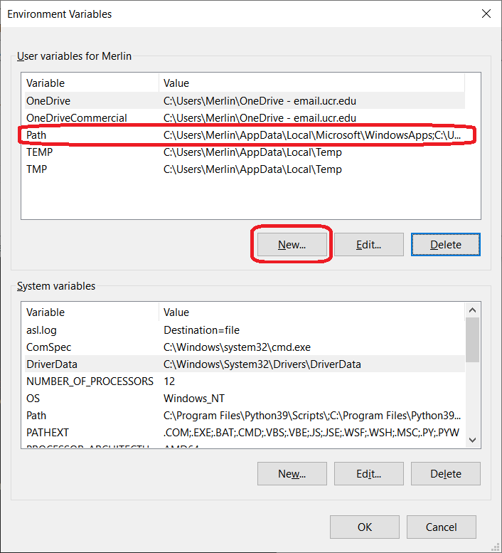</p>
4. Repeat step 3 for the following 3 variables:

    | **Variable name** | **Variable value**      |
    |-------------------|-------------------------|
    | `JAVA_HOME`       | `C:\jdk1.8.0_333`       |
    | `MAVEN_HOME`      | `C:\apache-maven-3.8.5` |
    | `HADOOP_HOME`     | `C:\hadoop-3.2.2`       |

    <p align="center">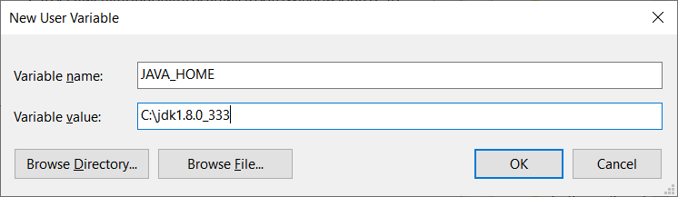</p>

5. You shall see the 3 variables added.
    <p align="center"></p>

6. Find `Path` under the **System** variables, double click or click **Edit** to edit it. If you find something similar to `C:\Program Files\Common Files\Oracle\Java\javapath`, **Delete** this it from `Path`.

7. Double click the variable `Path` (if you add the 3 `*_HOME` variables for the user, edit `Path` for the user, otherwise, edit `Path` for the system).

8. Add the following 3 lines (you can click **New** or just double click on an empty line).

    ```text
    %JAVA_HOME%\bin
    %MAVEN_HOME%\bin
    %HADOOP_HOME%\bin
    ```

    <p align="center">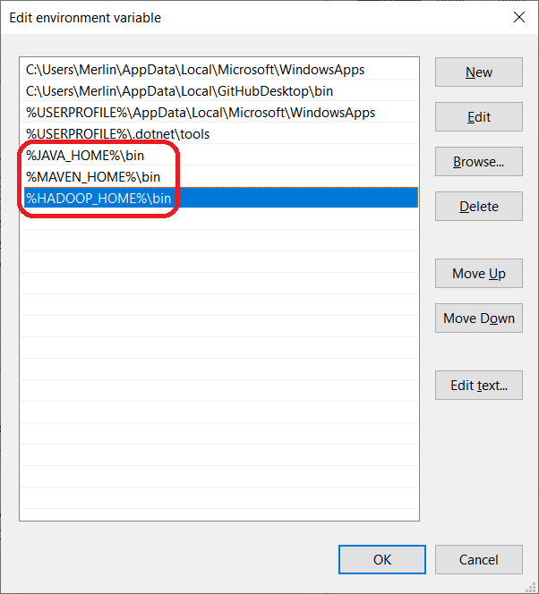</p>

9. Click **OK** multiple times until the **System Properties** dialog (step 2) is closed. Then restart Command Promot or Windows Terminal.

10. Test `*_HOME`, run
    - Command Promot

        ```console
        echo %JAVA_HOME%
        echo %MAVEN_HOME%
        echo %HADOOP_HOME%
        ```

    - PowerShell ([Windows Terminal](https://www.microsoft.com/en-us/p/windows-terminal/9n0dx20hk701))

        ```console
        echo $Env:JAVA_HOME
        echo $Env:MAVEN_HOME
        echo $Env:HADOOP_HOME
        ```

    They should not print empty lines, but the paths you just configured.

11. Test Java compiler, run

    ```console
    javac -version
    ```

    It should print

    ```text
    javac 1.8.0_333
    ```

12. Test Maven, run

    ```console
    mvn -version
    ```

    It should print (path and OS information may differ)

    ```text
    Apache Maven 3.8.5 (3599d3414f046de2324203b78ddcf9b5e4388aa0)
    Maven home: C:\apache-maven-3.8.5
    Java version: 1.8.0_333, vendor: Oracle Corporation, runtime: C:\jdk1.8.0_333\jre
    Default locale: en_US, platform encoding: Cp1252
    OS name: "windows 10", version: "10.0", arch: "amd64", family: "windows"
    ```

13. Test Hadoop, run

    ```bash
    hadoop version
    ```

    It should print

    ```text
    Hadoop 3.2.2
    Source code repository Unknown -r 7a3bc90b05f257c8ace2f76d74264906f0f7a932
    Compiled by hexiaoqiao on 2021-01-03T09:26Z
    Compiled with protoc 2.5.0
    From source with checksum 5a8f564f46624254b27f6a33126ff4
    This command was run using /C:/hadoop-3.2.2/share/hadoop/common/hadoop-common-3.2.2.jar
    ```

---

## Create WordCount Project in IntelliJ

1. Open IntelliJ, click **New Project**.
     <p align="center"></p>

2. Expand **Advanced Settings**, set **GroupId** to `edu.ucr.cs.merlin` (you can change the GroupId by any string you like), set **ArtifactId** to `wordcount`. The **Name** should automatically change, you can give it a different name if you want. Make sure JDK is showing `1.8` or `8`. **Build system** should be `Maven`. Click **Create**.
     <p align="center">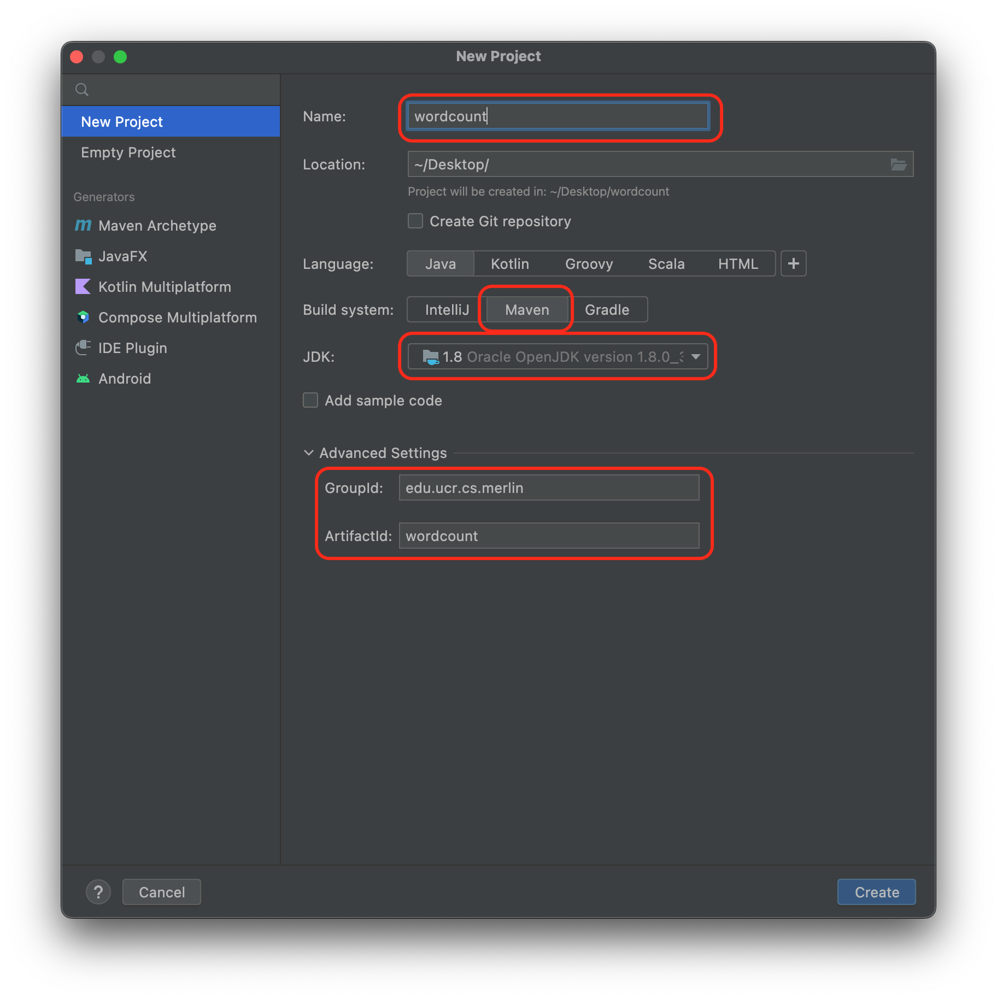</p>

3. It takes some time to load and download necessary dependencies (there will be a progress bar in the bottom).

4. File `pom.xml` should open automatically.
     <p align="center">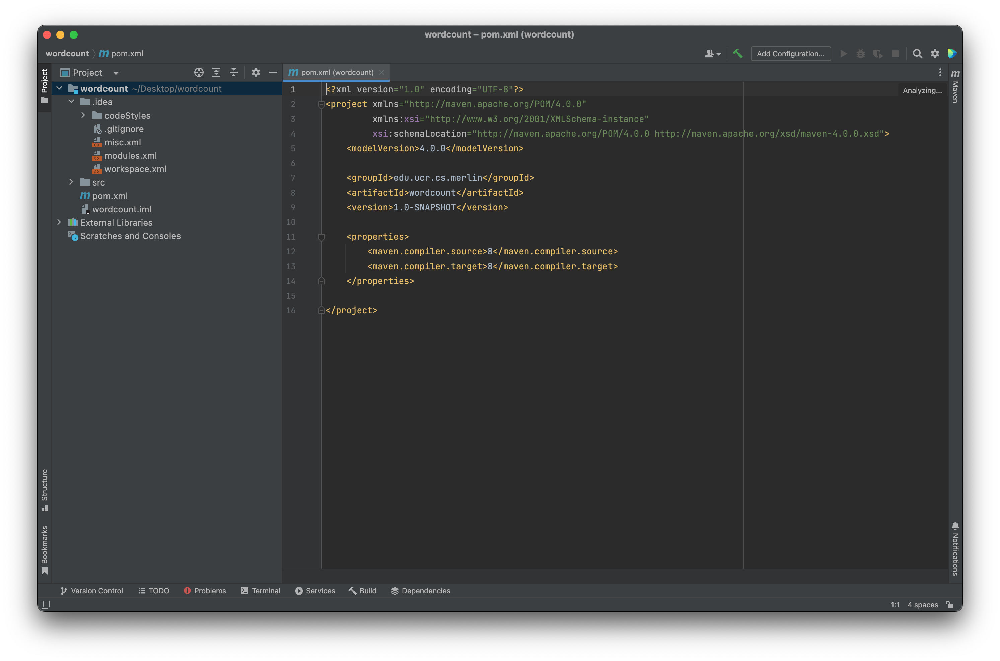</p>

5. Add the following line to `<properties>` block.
    - Linux and macOS

        ```xml
        <hadoop.version>3.3.3</hadoop.version>
        ```

    - Windows

        ```xml
        <hadoop.version>3.2.2</hadoop.version>
        ```

6. Add the following blocks to the XML root `<project>`.

    ```xml
    <dependencies>
        <dependency>
            <groupId>org.apache.hadoop</groupId>
            <artifactId>hadoop-client</artifactId>
            <version>${hadoop.version}</version>
        </dependency>
        <dependency>
            <groupId>org.apache.hadoop</groupId>
            <artifactId>hadoop-common</artifactId>
            <version>${hadoop.version}</version>
        </dependency>
    </dependencies>
    <repositories>
        <repository>
            <id>apache</id>
            <url>http://maven.apache.org</url>
        </repository>
    </repositories>
    ```

7. `pom.xml` should look like this.

    <details>
    <summary>Click to expand</summary>

    ```xml
    <?xml version="1.0" encoding="UTF-8"?>
    <project xmlns="http://maven.apache.org/POM/4.0.0"
            xmlns:xsi="http://www.w3.org/2001/XMLSchema-instance"
            xsi:schemaLocation="http://maven.apache.org/POM/4.0.0 http://maven.apache.org/xsd/maven-4.0.0.xsd">
        <modelVersion>4.0.0</modelVersion>
        <groupId>edu.ucr.cs.merlin</groupId>
        <artifactId>wordcount</artifactId>
        <version>1.0-SNAPSHOT</version>
        <properties>
            <maven.compiler.source>8</maven.compiler.source>
            <maven.compiler.target>8</maven.compiler.target>
            <hadoop.version>3.3.3</hadoop.version>
        </properties>
        <dependencies>
            <dependency>
                <groupId>org.apache.hadoop</groupId>
                <artifactId>hadoop-client</artifactId>
                <version>${hadoop.version}</version>
            </dependency>
            <dependency>
                <groupId>org.apache.hadoop</groupId>
                <artifactId>hadoop-common</artifactId>
                <version>${hadoop.version}</version>
            </dependency>
        </dependencies>
        <repositories>
            <repository>
                <id>apache</id>
                <url>http://maven.apache.org</url>
            </repository>
        </repositories>
    </project>
    ```

    </details>

    <p align="center">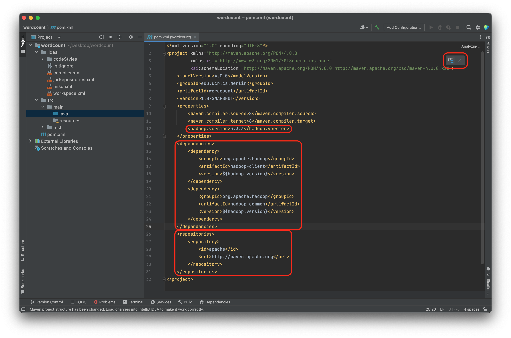</p>

8. Click the floating ***m*** icon to reload Maven dependencies.
     <p align="center"></p>

9. In the left Project Browser, select **src** &rarr; **main** &rarr; **java**. Right click, select **New**, then **Package**.
     <p align="center">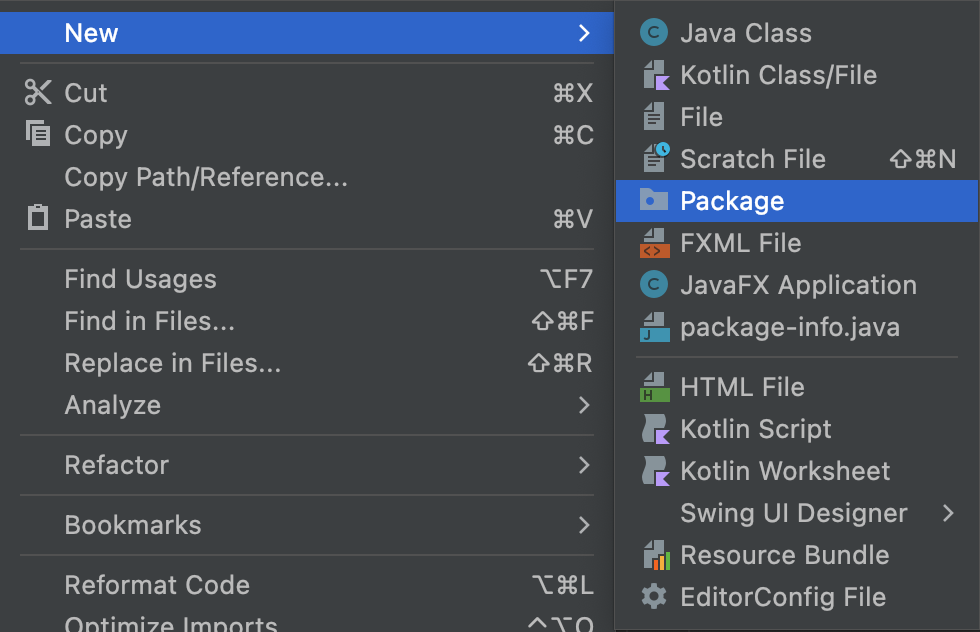</p>

10. Set the package name to `edu.ucr.cs.merlin` (you may use other name).
     <p align="center"></p>

11. In the left Project Browser, select the package you just created. Right click, select **New**, then **Java Class**.
     <p align="center">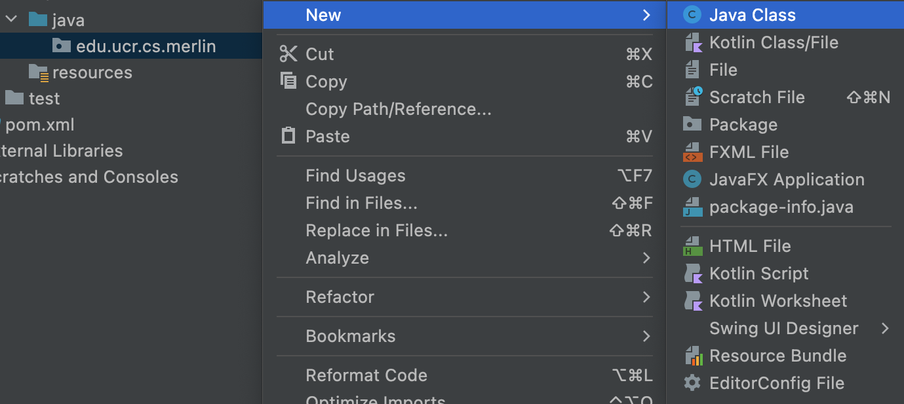</p>

12. Set the class name to `WordCount`.
     <p align="center">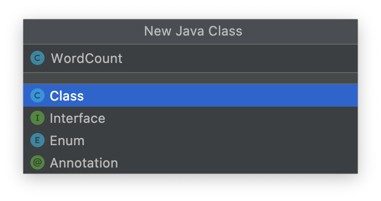</p>

13. In the left Project Browser, open **WordCount** class, paste the following code (keep the first `package` line).

    ```java
    import java.io.IOException;
    import java.util.StringTokenizer;

    import org.apache.hadoop.conf.Configuration;
    import org.apache.hadoop.fs.Path;
    import org.apache.hadoop.io.IntWritable;
    import org.apache.hadoop.io.Text;
    import org.apache.hadoop.mapreduce.Job;
    import org.apache.hadoop.mapreduce.Mapper;
    import org.apache.hadoop.mapreduce.Reducer;
    import org.apache.hadoop.mapreduce.lib.input.FileInputFormat;
    import org.apache.hadoop.mapreduce.lib.output.FileOutputFormat;

    public class WordCount {

        public static class TokenizerMapper
                extends Mapper<Object, Text, Text, IntWritable> {

            private final static IntWritable one = new IntWritable(1);
            private final Text word = new Text();

            public void map(Object key, Text value, Context context
            ) throws IOException, InterruptedException {
                StringTokenizer itr = new StringTokenizer(value.toString());
                while (itr.hasMoreTokens()) {
                    word.set(itr.nextToken());
                    context.write(word, one);
                }
            }
        }

        public static class IntSumReducer
                extends Reducer<Text, IntWritable, Text, IntWritable> {
            private IntWritable result = new IntWritable();

            public void reduce(Text key, Iterable<IntWritable> values,
                            Context context
            ) throws IOException, InterruptedException {
                int sum = 0;
                for (IntWritable val : values) {
                    sum += val.get();
                }
                result.set(sum);
                context.write(key, result);
            }
        }

        public static void main(String[] args) throws Exception {
            Configuration conf = new Configuration();
            Job job = Job.getInstance(conf, "word count");
            job.setJarByClass(WordCount.class);
            job.setMapperClass(TokenizerMapper.class);
            job.setCombinerClass(IntSumReducer.class);
            job.setReducerClass(IntSumReducer.class);
            job.setOutputKeyClass(Text.class);
            job.setOutputValueClass(IntWritable.class);
            FileInputFormat.addInputPath(job, new Path(args[0]));
            FileOutputFormat.setOutputPath(job, new Path(args[1]));
            System.exit(job.waitForCompletion(true) ? 0 : 1);
        }
    }
    ```

    - This is from the original Hadoop [MapReduce Tutorial](https://hadoop.apache.org/docs/current/hadoop-mapreduce-client/hadoop-mapreduce-client-core/MapReduceTutorial.html).

     <p align="center">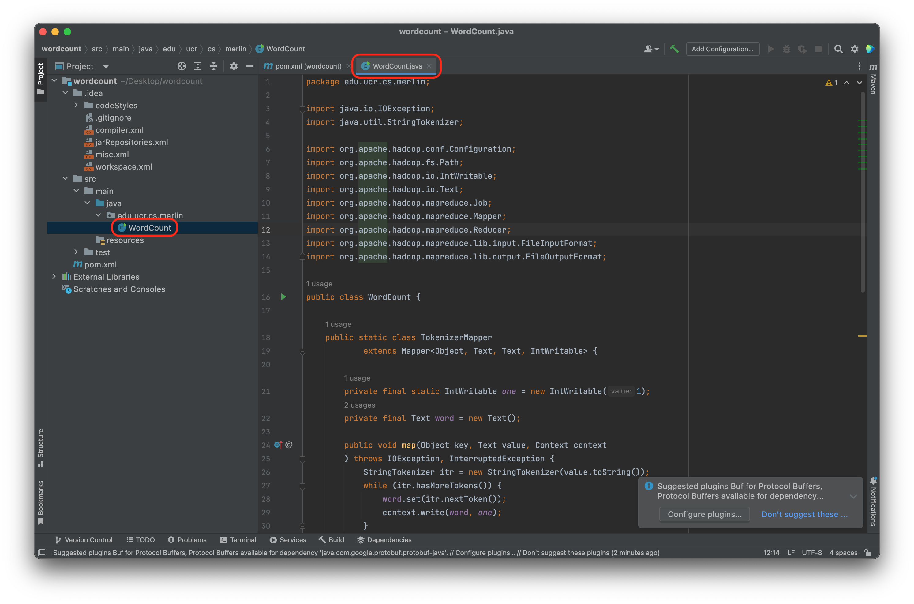</p>

14. Right click **WordCount** either in the Project Browser or on the open tab (circled in the above image), select **Run 'WordCount.main()'**.
     <p align="center">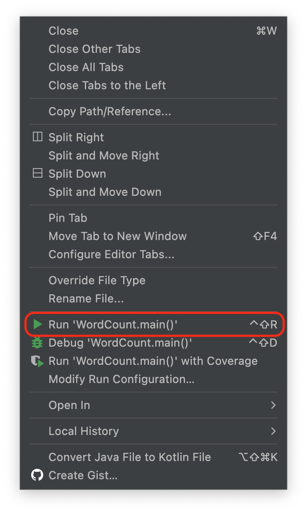</p>

15. IntelliJ should compile your code and run the class. But this time it will fail, you shall see the following messages.

    ```text
    log4j:WARN No appenders could be found for logger (org.apache.hadoop.metrics2.lib.MutableMetricsFactory).
    log4j:WARN Please initialize the log4j system properly.
    log4j:WARN See http://logging.apache.org/log4j/1.2/faq.html#noconfig for more info.
    Exception in thread "main" java.lang.ArrayIndexOutOfBoundsException: 0
        at edu.ucr.cs.merlin.WordCount.main(WordCount.java:59)

    Process finished with exit code 1
    ```

    This step is just to test whether your code compiles, and create a configuration for the class.

16. In the left Project Browser, create a folder `input` under your project's root folder, put any text file(s) into `input` for testing.
     <p align="center">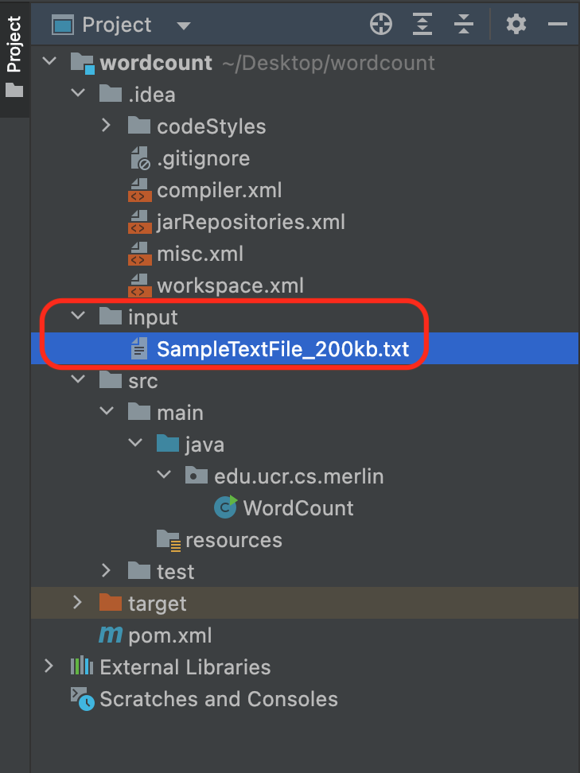</p>

17. On the top right, find **WordCount** next to a green hammer icon, click the down triangle icon, and select **Edit Configurations**.  
     <p align="center">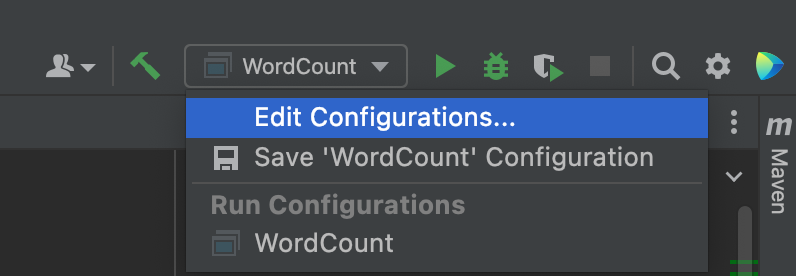</p>

18. Check if the first box under **Build and run** is shown `java 8` or `java 1.8`. Set `input output` to the third box (second line), and **OK**.
     <p align="center">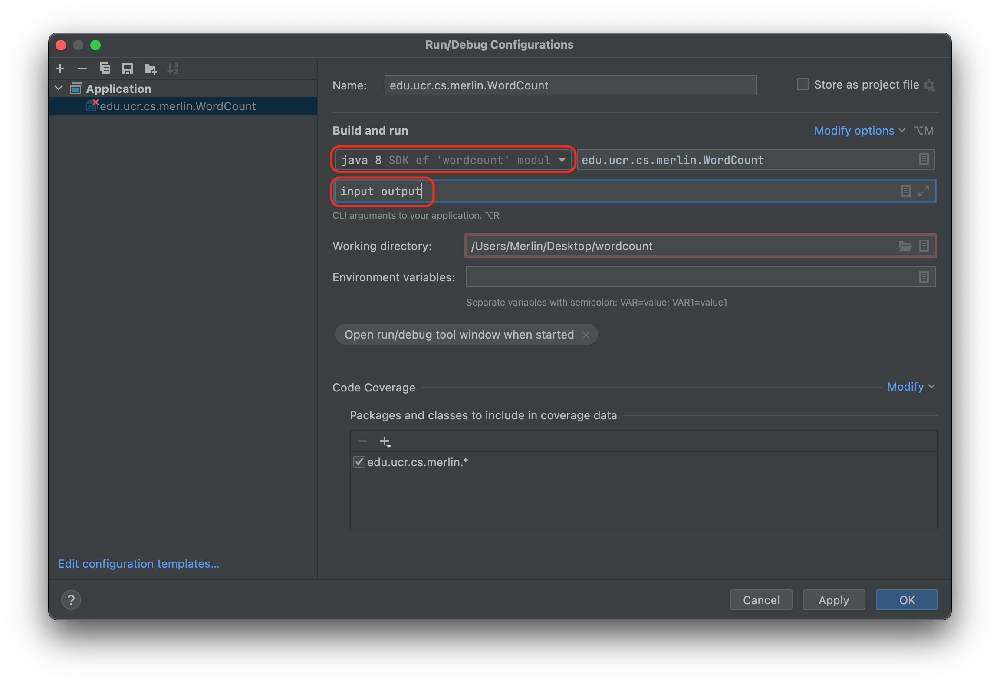</p>

19. **Run 'WordCount.main()'** again.
    - If you want to rerurn your program, you will need to delete the `output` folder before rerunning it, otherwise you will see some FileAlreadyExists exceptions.

20. The program will create an `output` folder with some files in it. The actual output files should have names `part-r-#####`.
     <p align="center">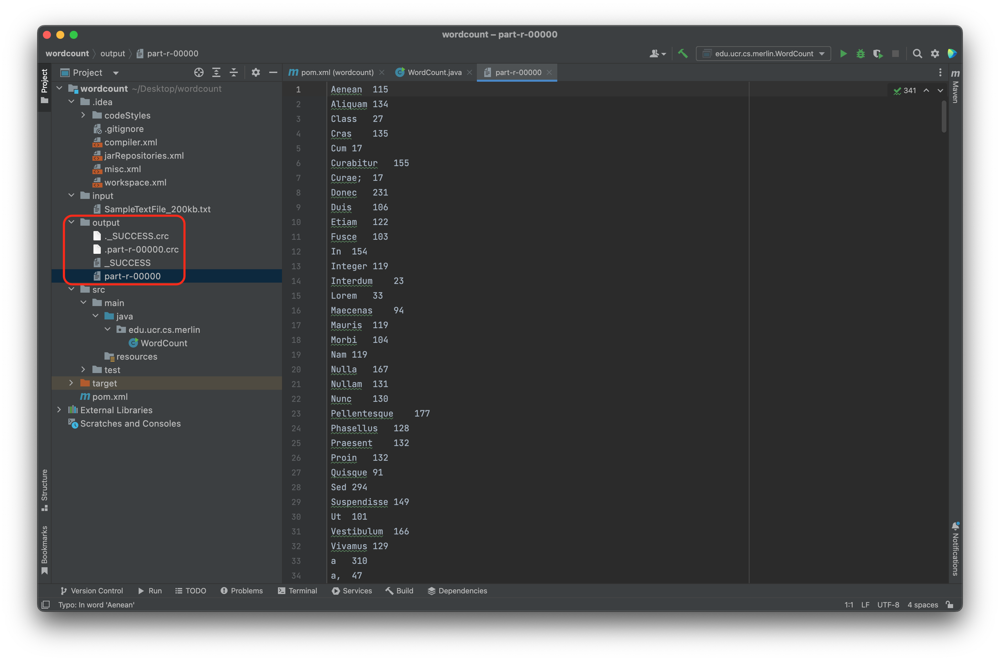</p>

---

## Run WordCount from Command Line

1. Build a runnable JAR package, `cd` to your project folder, then run

    ```bash
    mvn package
    ```

2. Run
    - Linux and macOS

        ```bash
        hadoop jar ./target/wordcount-1.0-SNAPSHOT.jar edu.ucr.cs.merlin.WordCount input output
        ```

    - Windows

        ```console
        hadoop jar .\target\wordcount-1.0-SNAPSHOT.jar edu.ucr.cs.merlin.WordCount input output
        ```

3. Example output

    <details>
    <summary>Click to expand</summary>

    ```text
    2022-05-30 16:27:12,954 INFO impl.MetricsConfig: Loaded properties from hadoop-metrics2.properties
    2022-05-30 16:27:13,047 INFO impl.MetricsSystemImpl: Scheduled Metric snapshot period at 10 second(s).
    2022-05-30 16:27:13,047 INFO impl.MetricsSystemImpl: JobTracker metrics system started
    2022-05-30 16:27:13,407 WARN mapreduce.JobResourceUploader: Hadoop command-line option parsing not performed. Implement the Tool interface and execute your application with ToolRunner to remedy this.
    2022-05-30 16:27:13,469 INFO input.FileInputFormat: Total input files to process : 1
    2022-05-30 16:27:13,485 INFO mapreduce.JobSubmitter: number of splits:1
    2022-05-30 16:27:13,563 INFO mapreduce.JobSubmitter: Submitting tokens for job: job_local1779310439_0001
    2022-05-30 16:27:13,579 INFO mapreduce.JobSubmitter: Executing with tokens: []
    2022-05-30 16:27:13,688 INFO mapreduce.Job: The url to track the job: http://localhost:8080/
    2022-05-30 16:27:13,688 INFO mapreduce.Job: Running job: job_local1779310439_0001
    2022-05-30 16:27:13,688 INFO mapred.LocalJobRunner: OutputCommitter set in config null
    2022-05-30 16:27:13,688 INFO output.FileOutputCommitter: File Output Committer Algorithm version is 2
    2022-05-30 16:27:13,688 INFO output.FileOutputCommitter: FileOutputCommitter skip cleanup _temporary folders under output directory:false, ignore cleanup failures: false
    2022-05-30 16:27:13,688 INFO mapred.LocalJobRunner: OutputCommitter is org.apache.hadoop.mapreduce.lib.output.FileOutputCommitter
    2022-05-30 16:27:13,735 INFO mapred.LocalJobRunner: Waiting for map tasks
    2022-05-30 16:27:13,735 INFO mapred.LocalJobRunner: Starting task: attempt_local1779310439_0001_m_000000_0
    2022-05-30 16:27:13,751 INFO output.FileOutputCommitter: File Output Committer Algorithm version is 2
    2022-05-30 16:27:13,751 INFO output.FileOutputCommitter: FileOutputCommitter skip cleanup _temporary folders under output directory:false, ignore cleanup failures: false
    2022-05-30 16:27:13,766 INFO util.ProcfsBasedProcessTree: ProcfsBasedProcessTree currently is supported only on Linux.
    2022-05-30 16:27:13,813 INFO mapred.Task:  Using ResourceCalculatorProcessTree : org.apache.hadoop.yarn.util.WindowsBasedProcessTree@5182131f
    2022-05-30 16:27:13,813 INFO mapred.MapTask: Processing split: file:/Users/Merlin/Desktop/wordcount/input/SampleTextFile_200kb.txt:0+204118
    2022-05-30 16:27:13,829 INFO mapred.MapTask: (EQUATOR) 0 kvi 26214396(104857584)
    2022-05-30 16:27:13,829 INFO mapred.MapTask: mapreduce.task.io.sort.mb: 100
    2022-05-30 16:27:13,829 INFO mapred.MapTask: soft limit at 83886080
    2022-05-30 16:27:13,829 INFO mapred.MapTask: bufstart = 0; bufvoid = 104857600
    2022-05-30 16:27:13,829 INFO mapred.MapTask: kvstart = 26214396; length = 6553600
    2022-05-30 16:27:13,829 INFO mapred.MapTask: Map output collector class = org.apache.hadoop.mapred.MapTask$MapOutputBuffer
    2022-05-30 16:27:13,876 INFO mapred.LocalJobRunner:
    2022-05-30 16:27:13,876 INFO mapred.MapTask: Starting flush of map output
    2022-05-30 16:27:13,876 INFO mapred.MapTask: Spilling map output
    2022-05-30 16:27:13,876 INFO mapred.MapTask: bufstart = 0; bufend = 322871; bufvoid = 104857600
    2022-05-30 16:27:13,876 INFO mapred.MapTask: kvstart = 26214396(104857584); kvend = 26094668(104378672); length = 119729/6553600
    2022-05-30 16:27:14,032 INFO mapred.MapTask: Finished spill 0
    2022-05-30 16:27:14,047 INFO mapred.Task: Task:attempt_local1779310439_0001_m_000000_0 is done. And is in the process of committing
    2022-05-30 16:27:14,047 INFO mapred.LocalJobRunner: map
    2022-05-30 16:27:14,047 INFO mapred.Task: Task 'attempt_local1779310439_0001_m_000000_0' done.
    2022-05-30 16:27:14,063 INFO mapred.Task: Final Counters for attempt_local1779310439_0001_m_000000_0: Counters: 18
            File System Counters
                    FILE: Number of bytes read=209564
                    FILE: Number of bytes written=556980
                    FILE: Number of read operations=0
                    FILE: Number of large read operations=0
                    FILE: Number of write operations=0
            Map-Reduce Framework
                    Map input records=655
                    Map output records=29933
                    Map output bytes=322871
                    Map output materialized bytes=6352
                    Input split bytes=135
                    Combine input records=29933
                    Combine output records=462
                    Spilled Records=462
                    Failed Shuffles=0
                    Merged Map outputs=0
                    GC time elapsed (ms)=94
                    Total committed heap usage (bytes)=514326528
            File Input Format Counters
                    Bytes Read=204118
    2022-05-30 16:27:14,063 INFO mapred.LocalJobRunner: Finishing task: attempt_local1779310439_0001_m_000000_0
    2022-05-30 16:27:14,063 INFO mapred.LocalJobRunner: map task executor complete.
    2022-05-30 16:27:14,063 INFO mapred.LocalJobRunner: Waiting for reduce tasks
    2022-05-30 16:27:14,063 INFO mapred.LocalJobRunner: Starting task: attempt_local1779310439_0001_r_000000_0
    2022-05-30 16:27:14,079 INFO output.FileOutputCommitter: File Output Committer Algorithm version is 2
    2022-05-30 16:27:14,079 INFO output.FileOutputCommitter: FileOutputCommitter skip cleanup _temporary folders under output directory:false, ignore cleanup failures: false
    2022-05-30 16:27:14,079 INFO util.ProcfsBasedProcessTree: ProcfsBasedProcessTree currently is supported only on Linux.
    2022-05-30 16:27:14,110 INFO mapred.Task:  Using ResourceCalculatorProcessTree : org.apache.hadoop.yarn.util.WindowsBasedProcessTree@39b4ed6a
    2022-05-30 16:27:14,110 INFO mapred.ReduceTask: Using ShuffleConsumerPlugin: org.apache.hadoop.mapreduce.task.reduce.Shuffle@5aab8cfc
    2022-05-30 16:27:14,110 WARN impl.MetricsSystemImpl: JobTracker metrics system already initialized!
    2022-05-30 16:27:14,126 INFO reduce.MergeManagerImpl: MergerManager: memoryLimit=360028576, maxSingleShuffleLimit=90007144, mergeThreshold=237618864, ioSortFactor=10, memToMemMergeOutputsThreshold=10
    2022-05-30 16:27:14,126 INFO reduce.EventFetcher: attempt_local1779310439_0001_r_000000_0 Thread started: EventFetcher for fetching Map Completion Events
    2022-05-30 16:27:14,157 INFO reduce.LocalFetcher: localfetcher#1 about to shuffle output of map attempt_local1779310439_0001_m_000000_0 decomp: 6348 len: 6352 to MEMORY
    2022-05-30 16:27:14,157 INFO reduce.InMemoryMapOutput: Read 6348 bytes from map-output for attempt_local1779310439_0001_m_000000_0
    2022-05-30 16:27:14,157 INFO reduce.MergeManagerImpl: closeInMemoryFile -> map-output of size: 6348, inMemoryMapOutputs.size() -> 1, commitMemory -> 0, usedMemory ->6348
    2022-05-30 16:27:14,157 INFO reduce.EventFetcher: EventFetcher is interrupted.. Returning
    2022-05-30 16:27:14,157 INFO mapred.LocalJobRunner: 1 / 1 copied.
    2022-05-30 16:27:14,157 INFO reduce.MergeManagerImpl: finalMerge called with 1 in-memory map-outputs and 0 on-disk map-outputs
    2022-05-30 16:27:14,173 INFO mapred.Merger: Merging 1 sorted segments
    2022-05-30 16:27:14,173 INFO mapred.Merger: Down to the last merge-pass, with 1 segments left of total size: 6339 bytes
    2022-05-30 16:27:14,173 INFO reduce.MergeManagerImpl: Merged 1 segments, 6348 bytes to disk to satisfy reduce memory limit
    2022-05-30 16:27:14,173 INFO reduce.MergeManagerImpl: Merging 1 files, 6352 bytes from disk
    2022-05-30 16:27:14,173 INFO reduce.MergeManagerImpl: Merging 0 segments, 0 bytes from memory into reduce
    2022-05-30 16:27:14,173 INFO mapred.Merger: Merging 1 sorted segments
    2022-05-30 16:27:14,173 INFO mapred.Merger: Down to the last merge-pass, with 1 segments left of total size: 6339 bytes
    2022-05-30 16:27:14,173 INFO mapred.LocalJobRunner: 1 / 1 copied.
    2022-05-30 16:27:14,188 INFO Configuration.deprecation: mapred.skip.on is deprecated. Instead, use mapreduce.job.skiprecords
    2022-05-30 16:27:14,188 INFO mapred.Task: Task:attempt_local1779310439_0001_r_000000_0 is done. And is in the process of committing
    2022-05-30 16:27:14,188 INFO mapred.LocalJobRunner: 1 / 1 copied.
    2022-05-30 16:27:14,188 INFO mapred.Task: Task attempt_local1779310439_0001_r_000000_0 is allowed to commit now
    2022-05-30 16:27:14,188 INFO output.FileOutputCommitter: Saved output of task 'attempt_local1779310439_0001_r_000000_0' to file:/Users/Merlin/Desktop/wordcount/output
    2022-05-30 16:27:14,188 INFO mapred.LocalJobRunner: reduce > reduce
    2022-05-30 16:27:14,188 INFO mapred.Task: Task 'attempt_local1779310439_0001_r_000000_0' done.
    2022-05-30 16:27:14,188 INFO mapred.Task: Final Counters for attempt_local1779310439_0001_r_000000_0: Counters: 24
            File System Counters
                    FILE: Number of bytes read=222300
                    FILE: Number of bytes written=568430
                    FILE: Number of read operations=0
                    FILE: Number of large read operations=0
                    FILE: Number of write operations=0
            Map-Reduce Framework
                    Combine input records=0
                    Combine output records=0
                    Reduce input groups=462
                    Reduce shuffle bytes=6352
                    Reduce input records=462
                    Reduce output records=462
                    Spilled Records=462
                    Shuffled Maps =1
                    Failed Shuffles=0
                    Merged Map outputs=1
                    GC time elapsed (ms)=0
                    Total committed heap usage (bytes)=514326528
            Shuffle Errors
                    BAD_ID=0
                    CONNECTION=0
                    IO_ERROR=0
                    WRONG_LENGTH=0
                    WRONG_MAP=0
                    WRONG_REDUCE=0
            File Output Format Counters
                    Bytes Written=5098
    2022-05-30 16:27:14,188 INFO mapred.LocalJobRunner: Finishing task: attempt_local1779310439_0001_r_000000_0
    2022-05-30 16:27:14,188 INFO mapred.LocalJobRunner: reduce task executor complete.
    2022-05-30 16:27:14,702 INFO mapreduce.Job: Job job_local1779310439_0001 running in uber mode : false
    2022-05-30 16:27:14,702 INFO mapreduce.Job:  map 100% reduce 100%
    2022-05-30 16:27:14,702 INFO mapreduce.Job: Job job_local1779310439_0001 completed successfully
    2022-05-30 16:27:14,717 INFO mapreduce.Job: Counters: 30
            File System Counters
                    FILE: Number of bytes read=431864
                    FILE: Number of bytes written=1125410
                    FILE: Number of read operations=0
                    FILE: Number of large read operations=0
                    FILE: Number of write operations=0
            Map-Reduce Framework
                    Map input records=655
                    Map output records=29933
                    Map output bytes=322871
                    Map output materialized bytes=6352
                    Input split bytes=135
                    Combine input records=29933
                    Combine output records=462
                    Reduce input groups=462
                    Reduce shuffle bytes=6352
                    Reduce input records=462
                    Reduce output records=462
                    Spilled Records=924
                    Shuffled Maps =1
                    Failed Shuffles=0
                    Merged Map outputs=1
                    GC time elapsed (ms)=94
                    Total committed heap usage (bytes)=1028653056
            Shuffle Errors
                    BAD_ID=0
                    CONNECTION=0
                    IO_ERROR=0
                    WRONG_LENGTH=0
                    WRONG_MAP=0
                    WRONG_REDUCE=0
            File Input Format Counters
                    Bytes Read=204118
            File Output Format Counters
                    Bytes Written=5098
    ```

    </details>

---

## Set Default Main Class in JAR (Optional)

1. Add the following block into `pom.xml`.

    ```xml
    <build>
    <plugins>
        <plugin>
        <groupId>org.apache.maven.plugins</groupId>
        <artifactId>maven-jar-plugin</artifactId>
        <configuration>
            <archive>
            <manifest>
                <mainClass>edu.ucr.cs.merlin.WordCount</mainClass>
            </manifest>
            </archive>
        </configuration>
        </plugin>
    </plugins>
    </build>
    ```

    <details>
    <summary>Expand to see the complete file</summary>

    ```xml
    <?xml version="1.0" encoding="UTF-8"?>
    <project xmlns="http://maven.apache.org/POM/4.0.0"
            xmlns:xsi="http://www.w3.org/2001/XMLSchema-instance"
            xsi:schemaLocation="http://maven.apache.org/POM/4.0.0 http://maven.apache.org/xsd/maven-4.0.0.xsd">
        <modelVersion>4.0.0</modelVersion>
        <groupId>edu.ucr.cs.merlin</groupId>
        <artifactId>wordcount</artifactId>
        <version>1.0-SNAPSHOT</version>
        <properties>
            <maven.compiler.source>8</maven.compiler.source>
            <maven.compiler.target>8</maven.compiler.target>
            <hadoop.version>3.3.3</hadoop.version>
        </properties>
        <dependencies>
            <dependency>
                <groupId>org.apache.hadoop</groupId>
                <artifactId>hadoop-client</artifactId>
                <version>${hadoop.version}</version>
            </dependency>
            <dependency>
                <groupId>org.apache.hadoop</groupId>
                <artifactId>hadoop-common</artifactId>
                <version>${hadoop.version}</version>
            </dependency>
        </dependencies>
        <repositories>
            <repository>
                <id>apache</id>
                <url>http://maven.apache.org</url>
            </repository>
        </repositories>
        <build>
            <plugins>
                <plugin>
                    <groupId>org.apache.maven.plugins</groupId>
                    <artifactId>maven-jar-plugin</artifactId>
                    <configuration>
                        <archive>
                            <manifest>
                                <mainClass>edu.ucr.cs.merlin.WordCount</mainClass>
                            </manifest>
                        </archive>
                    </configuration>
                </plugin>
            </plugins>
        </build>
    </project>
    ```

    </details>

2. Rebuild package via `mvn package`.

3. Run (without specifying the class name)
    - Linux and macOS

        ```bash
        hadoop jar ./target/wordcount-1.0-SNAPSHOT.jar input output
        ```

    - Windows

        ```console
        hadoop jar .\target\wordcount-1.0-SNAPSHOT.jar input output
        ```

---

## Example Project

See [wordcount](./wordcount/)
